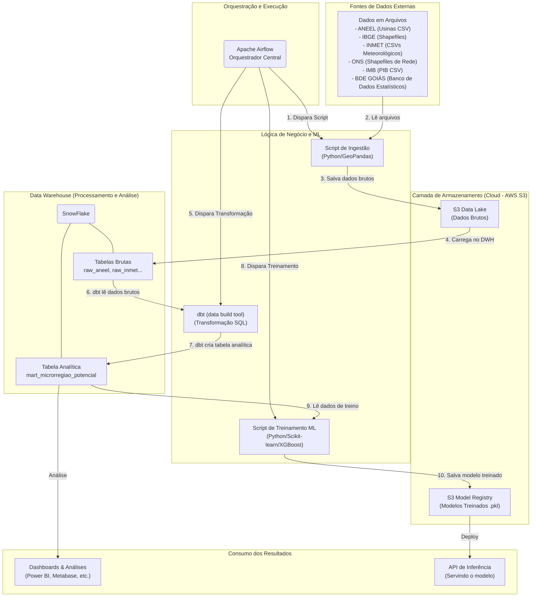

# Projeto Goiás Renovável — ml-politicas-energeticas-ifg-2025


# Descrição do projeto

Este repositório contém o código, DAGs, notebooks e utilitários para o pipeline de ingestão, transformação (dbt) e treino de modelos para o projeto "Goiás Renovável" — Módulo 2 do curso POS IA IFG (2025/1). O fluxo geral é ingestão de dados públicos → armazenamento em S3 → carga no DWH → transformações com dbt → treinamento e registro de modelos.

## Estrutura do repositório (visão simplificada)

- `dags/` — Airflow DAGs responsáveis por ingestão, ETL/ELT e tarefas operacionais.
- `dbt/` e `include/dbt_inmet_s3_ingestion/` — projetos dbt com modelos SQL para transformação de dados INMET/RAW.
- `scripts/` — utilitários (upload S3, manipulação de nomes, helpers).
- `drive/` — amostras de dados e artefatos (não versionar dados sensíveis em repositórios públicos).
- Notebooks na raiz (`*.ipynb`) — análises exploratórias e notebooks de treinamento (Colab-ready).
- `requirements.txt` — dependências Python (existem também `requirements.txt` em subprojetos/dbt).
- `Dockerfile`, `compose/` — configuração de runtime para Airflow/Astro.

> Observação: a lógica auxiliar está espalhada entre `dags/` e `scripts/`. Recomenda-se consolidar em `src/` para melhor testabilidade e reutilização.

---



---

## Setup mínimo (local de desenvolvimento)

1) Criar ambiente Python e instalar dependências:

```bash
python -m venv .venv
source .venv/bin/activate
pip install -r requirements.txt
```

2) Configurar conexões e variáveis (Airflow):
- Criar conexões `aws_default` e `snowflake_default` via UI do Airflow ou `airflow connections add`.
- Preferir Secret Backends ou AWS Secrets Manager para credenciais.

3) Rodar Airflow local (ex.: Astronomer ou docker-compose conforme `compose/`):

```bash
# Exemplo com Astro (se usar Astronomer):
# astro dev start

# Exemplo com docker-compose (ajuste caminhos conforme necessário):
# docker-compose -f compose/airflow.yml up --build
```

4) Executar dbt (dentro do ambiente/contêiner apropriado):

```bash
# entre no diretório do projeto dbt
cd include/dbt_inmet_s3_ingestion
# dbt run --profiles-dir . --project-dir .
```

---

## DAGs (descrição breve) — atenção ao diretório `dags/`

Lista resumida das DAGs encontradas e propósito operacional (mantenha esta seção atualizada):

- `dbt_snowflake_dag.py`
  - DAG de debugging: procura `profiles.yml` e executa `dbt debug` para validar configuração do dbt.

- `dbt_inmet_dag.py`
  - Orquestra execução de modelos dbt por ano. Invoca `dbt run --select dados_meteriologicos_inmet` passando variável `inmet_s3_path` para consumir CSVs INMET no S3.

- `inmet_data_to_snowflake_dbt_etl.py`
  - Pipeline ELT principal: cria file formats/staging no Snowflake, enumera arquivos S3 por ano, executa `COPY INTO` para inserir raw CSVs no staging e mapeia tasks por arquivo/ano com TaskFlow e TaskGroup.

- `read_data_then_sent.py` (s3_to_snowflake_inmet_loader)
  - Lê arquivos S3 via boto3/S3Hook, processa CSV com pandas (latin-1, skiprows) e escreve no Snowflake via `write_pandas`.

- Variações `inmet_csv_to_s3*` (`inmet_csv_to_s3.py`, `inmet_csv_to_s3_all_years.py`, `inmet_csv_to_s3_decorators.py`, `inmet_csv_to_s3_streaming`)
  - Pipelines para baixar ZIPs do portal INMET, extrair CSVs (local ou em memória) e enviar para S3 — diferentes estratégias (streaming, in-memory, paralelização).

- `inmet_data_download.py`, `inmet_data_download_all.py`
  - DAGs focadas no download e preparação dos arquivos (por ano).

- `inmet_data_cleaner.py`, `clean_s3_keep_go_csv.py`
  - Limpeza e retenção seletiva no bucket S3 (mantém arquivos que contenham padrão `_GO_` ou `GO`).

Observação: a maioria dos DAGs inclui comentários explicativos — bom para operação. Recomendo extrair helpers (S3 list/upload, parsing CSV, COPY INTO builders) para `src/`.

---

## Uso do dbt para ELT e Snowflake

O projeto usa dbt como camada de transformação (T no ELT). Padrão observado:

1. Ingestão: arquivos CSV são colocados no S3 (raw).
2. Load: DAGs realizam a carga para o DWH (Snowflake) — via `COPY INTO` ou `write_pandas`.
3. Transformação com dbt: os modelos dbt leem as tabelas staging no DWH e produzem tabelas/visões analíticas (marts).

Recomendações práticas:

- Padronizar `profiles.yml` para Snowflake (ou documentar perfis distintos) e colocar `profiles.example.yml` no repositório com placeholders.
- Preferir `COPY INTO` para cargas em escala; use `write_pandas` para cargas pequenas/experimentais.
- Criar jobs dbt (`dbt run`, `dbt test`) como tasks airflow ou via Cosmos (já há indícios de uso de `cosmos.DbtDag`).

---

## Observações sobre reprodutibilidade e segurança

- Já existem `Dockerfile` e `compose/` para rodar Airflow (boa prática).
- Falta fornecer `.env.example`, `profiles.example.yml` e instruções de preenchimento para variáveis sensíveis.
- Não versionar credenciais; usar Airflow Connections e Secret Backends.

---

## Sugestões de curto prazo (práticas)

1. Adicionar `profiles.example.yml` para dbt (Snowflake) e `.env.example` com variáveis esperadas.
2. Criar `src/` com helpers reutilizáveis e um teste pytest simples (S3 list, parser CSV).
3. Adicionar `LICENSE` (MIT/Apache) e `CONTRIBUTING.md`.
4. Criar CI (GitHub Actions) com lint + pytest + dbt test (opcional, em infra separada).

---

## Checklist

Itens OK ✅
- README com diagrama e contexto (atualizado nesta versão).
- DAGs em `dags/` com comentários e docstrings.
- `requirements.txt` e `Dockerfile` presentes.
- dbt project presente.

Itens pendentes ⚠️
- Criar `src/` para código reutilizável.
- `profiles.example.yml` e `.env.example` ausentes.
- Padronizar `profiles.yml` (Snowflake vs ClickHouse).
- Adicionar LICENSE e CONTRIBUTING.md.
- Implementar testes e CI.

---

Se desejar, posso agora:

- Gerar `profiles.example.yml` para Snowflake e um `.env.example` com as variáveis necessárias;
- Criar um `src/` inicial com S3/Snowflake helpers e um teste pytest básico;
- Adicionar `LICENSE` (me diga MIT ou Apache-2.0).

Indique qual ação quer que eu execute em seguida e eu aplico as alterações automaticamente.
