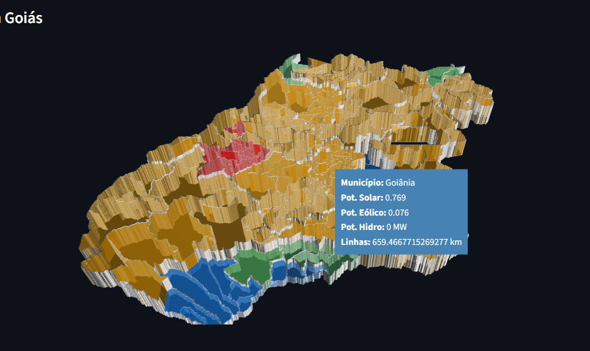
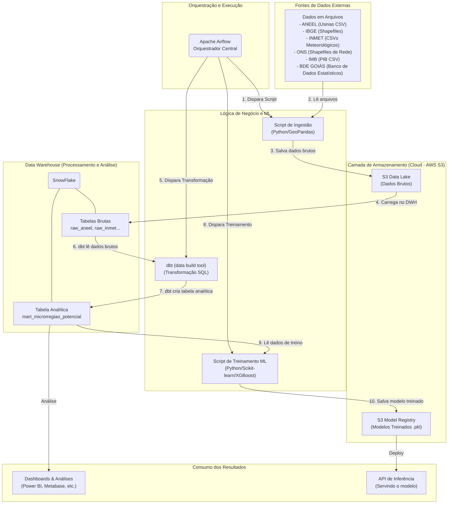

# Projeto Goiás Renovável — ml-politicas-energeticas-ifg-2025

## Visão geral

Este repositório contém o código, DAGs, notebooks e utilitários para o pipeline de ingestão, transformação (dbt) e treinamento de modelos do projeto "Goiás Renovável" — Módulo 2 do curso POS IA IFG (2025/1). O fluxo geral é: ingestão de dados públicos → armazenamento em S3 → carga no DWH → transformações com dbt → treinamento e registro de modelos.

## Modelo de Análise

[Análise Potencial](http://20.206.241.65:8501/)

[](http://20.206.241.65:8501/)
## Arquitetura (mermaid)



## Estrutura do repositório (resumo)

- `dags/` — Airflow DAGs de ingestão, ETL/ELT e tarefas operacionais.
- `dbt/` e `include/dbt_inmet_s3_ingestion/` — projetos dbt para transformação de dados.
- `scripts/` — utilitários (upload S3, manipulação de nomes, helpers).
- `drive/` — amostras de dados e artefatos (não versionar dados sensíveis).
- Notebooks na raiz (`*.ipynb`) — EDA e treinamento.
- `requirements.txt` — dependências Python (existem `requirements.txt` também nos subprojetos dbt).
- `Dockerfile`, `compose/` — configuração de runtime para Airflow.

> Observação: há lógica auxiliar em `dags/` e `scripts/`. Recomenda-se consolidar em `src/` para melhor testabilidade e reutilização.

---

## Pré-requisitos

- Python 3.10+ para execução local de scripts.
- Docker e Docker Compose para orquestrar Airflow localmente.
- Credenciais AWS (para acesso ao S3) e credenciais Snowflake (para carga/transformação), configuradas via Airflow Connections ou variáveis de ambiente.

---

## Setup rápido (local)

1) Criar ambiente Python e instalar dependências:

```bash
python -m venv .venv
source .venv/bin/activate
pip install -r requirements.txt
```

2) Configurar conexões e variáveis (Airflow):
- Criar conexões `aws_default` e `snowflake_default` via UI do Airflow (Recom.) ou via CLI.
- Preferir Secret Backends ou AWS Secrets Manager para credenciais.

---

## Executando com Docker Compose (Airflow)

Suba um cluster simples (webserver em http://localhost:8081):

```bash
docker compose -f compose/airflow.yml up --build -d
```

Primeiro acesso e checagens úteis:

```bash
# Ver logs do webserver
docker compose -f compose/airflow.yml logs -f airflow-webserver

# Listar DAGs disponíveis
docker compose -f compose/airflow.yml exec airflow-webserver airflow dags list

# (Exemplo) disparar uma DAG pelo ID
docker compose -f compose/airflow.yml exec airflow-webserver \
  airflow dags trigger <SEU_DAG_ID>
```

Outros serviços:
- Flower: http://localhost:5555
- Redis: 6379 (local)

Para encerrar:

```bash
docker compose -f compose/airflow.yml down -v
```

---

## Executando dbt

Execute dbt no projeto de ingestão INMET (ajuste o profile conforme seu ambiente):

```bash
cd include/dbt_inmet_s3_ingestion
dbt debug --profiles-dir . --project-dir .
dbt run   --profiles-dir . --project-dir .
dbt test  --profiles-dir . --project-dir .
```

---

## Scripts úteis

Upload de arquivos listados em `drive/files.txt` para S3 (vide `scripts/README.md` para detalhes):

```bash
# Dry-run (somente verificar caminhos)
python3 scripts/upload_files_to_s3.py --dry-run --prefix drive

# Upload (defina bucket e prefix conforme necessário)
python3 scripts/upload_files_to_s3.py --bucket <SEU_BUCKET> --prefix drive --upload-metrics
```

Outros scripts:
- `scripts/list_s3.py`, `scripts/rename_s3_files.sh` — utilitários diversos. Use `-h` para ajuda quando disponível.

---

## Notebooks

- `exploratory_data_analysis.ipynb` — EDA básica.
- `CC_ML_TRAINING_MODEL.ipynb` — treinamento de modelo (Colab-ready).
- [`CC_ML_TRAINING_MODEL.ipynb`](https://colab.research.google.com/drive/1jHJq_-zXsGDkPS3lfudIrirHqU68i9jX?usp=sharing)  — treinamento de modelo (Colab Execution).

Recomendação: use um kernel Python do seu virtualenv (`.venv`) e garanta que as dependências estejam instaladas.

---

## DAGs (descrição breve)

- `dbt_snowflake_dag.py` — DAG de debugging: executa `dbt debug` para validar configuração do dbt.
- `dbt_inmet_dag.py` — Executa modelos dbt por ano; seleciona `dados_meteriologicos_inmet` via `--select` lendo CSVs INMET no S3.
- `inmet_data_to_snowflake_dbt_etl.py` — Pipeline ELT principal: cria file formats/staging, lista S3 e executa `COPY INTO` para staging.
- `read_data_then_sent.py` — Leitura de S3 com pandas e carga via `write_pandas` no Snowflake.
- `inmet_csv_to_s3*` — Variações de download/envelope para S3 (streaming, in-memory, paralelização).
- `inmet_data_download*.py` — Download e preparação por ano.
- `inmet_data_cleaner.py`, `clean_s3_keep_go_csv.py` — Limpeza e retenção seletiva no bucket S3.


---


## 👥 Equipe

| Foto | Nome |  GitHub |
|:---:|:---|:---|
|  | **Fabio A. M. Paula |[@Fabioaugustmp](https://github.com/Fabioaugustmp) |
|  | **Marcelo R. Carvalho**  | [@dr-marcelocarvalho](https://github.com/dr-marcelocarvalho)|
|  | **Rafael F. Costa**  | [@Ficheles](https://github.com/ficheles) |
|  | **Raony N. Nogueira**  | [@NascimentoRaony](https://github.com/NascimentoRaony) |

---
